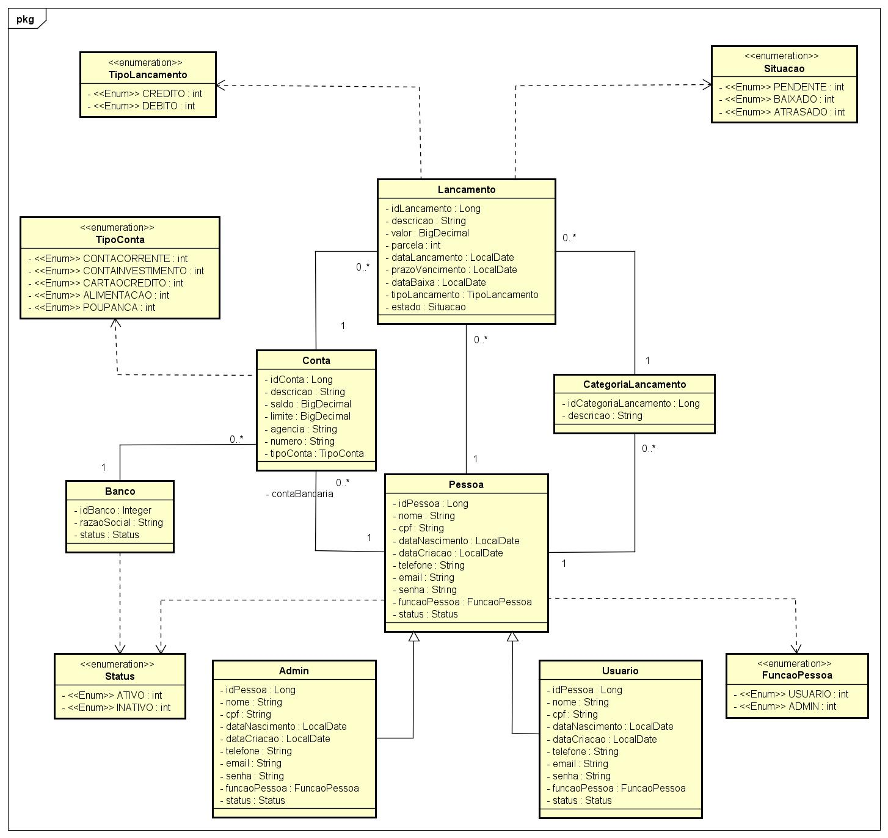

# Financial Manager Project

Sistema completo para gestão financeira pessoal que permite o controle de contas bancárias, lançamentos financeiros e categorização de transações. Desenvolvido para auxiliar usuários no acompanhamento de sua saúde financeira com diferentes tipos de contas e transações.
Funcionalidades

# Diagrama de Classe



## Tecnologias

     

## Ferramentas

 

## Como Executar

1. Clone o repositório
```
.git clone https://github.com/josevissoti/financial-manager-project.git
```

2. Configure o banco de dados no `application.properties`
```
spring.application.name=manager
spring.profiles.active=test
```

3. Execute a aplicação:
```
mvn spring-boot:run
```
## Contribuidores

* [José Pedro Vissoti](https://github.com/josevissoti)
* [Enzo Barbosa Dourado de Almeida](https://github.com/enzo-barbosa)
